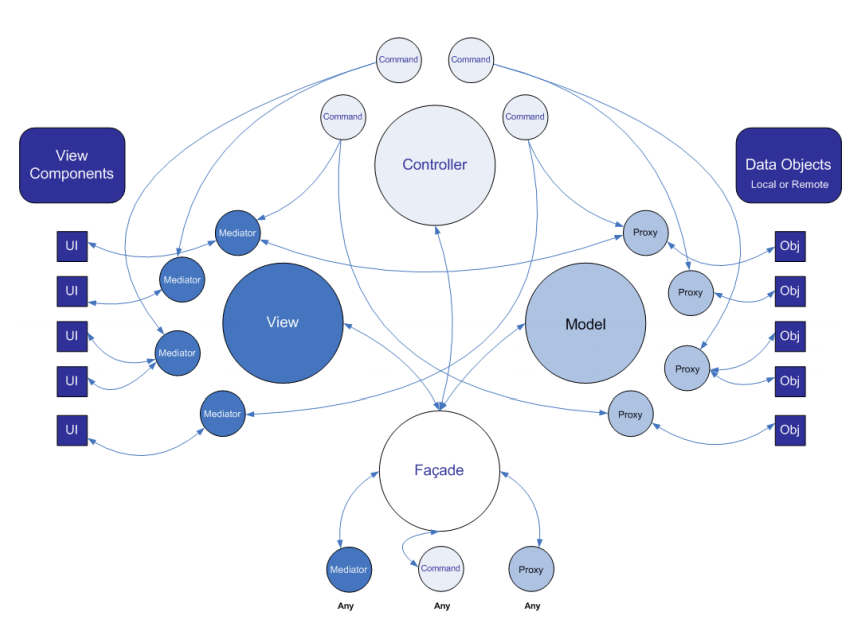

# [Unity框架]PureMVC在unity中的简单使用



[TOC]

>PureMVC是一个完整规范的程序框架，Unity是一个基于组件设计的，如果规划得当，各组件之间的调用也会变的简单，系统结构也会显得有条理，下面就给大家介绍下PureMVC在unity中的使用，一起来看看吧。

效果图：

  

如上图所示，是一个十分简单的东西，但这次我们要结合PureMVC去实现它。

## 实现

### 1.首先，我们知道要使用PureMVC，最主要就是去实现Facade、Proxy、Mediator、SimpleCommand(或MacroCommand)的子类，而这些子类显然是不能挂在物体上的。因为子类没有继承MonoBehaviour，所以常用的Find、GetComponent我们是用不到的，这时候我们就可以把MonoBehaviour的一部分功能封装到一个类里，由这些子类去调用，这样就可以解决问题了。

```csharp
1.  using UnityEngine;  
2.  using System.Collections;  
3.    
4.  public class GameUtility {  
5.    
6.      ///   
7.      /// 获取子节点  
8.      ///   
9.      public static Transform GetChild(GameObject root, string path)  
10.      {  
11.          Transform tra = root.transform.Find(path);  
12.          if (tra == null) Debug.Log(path + "not find");  
13.          return tra;  
14.      }  
15.    
16.      ///   
17.      /// 获取子节点组件  
18.      ///   
19.      public static T GetChildComponent(GameObject root, string path) where T : Component  
20.      {  
21.          Transform tra = root.transform.Find(path);  
22.          if (tra == null) Debug.Log(path + "not find");  
23.          T t = tra.GetComponent();  
24.          return t;  
25.      }  
26.  }  
```
  
### 2.同时我们也知道PureMVC的通信是通过Notification和观察者模式去实现的，Notification通常用字符串常量去表示，为了方便管理，应该把这些常量放到一个类中。

```csharp
1.  using UnityEngine;  
2.  using System.Collections;  
3.    
4.  public class NotificationConstant {  
5.    
6.      public const string LevelUp = "LevelUp";  
7.      public const string LevelChange = "LevelChange";  
8.  }  
```

### 3.接下来我们对数据进行定义。TestProxy会在数据发生变化时发送通知，进而更新view组件。

```csharp
1.  using UnityEngine;  
2.  using System.Collections;  
3.    
4.  public class CharacterInfo {  
5.    
6.      public int Level { get; set; }  
7.      public int Hp { get; set; }  
8.    
9.      public CharacterInfo()  
10.      {  
11.    
12.      }  
13.    
14.      public CharacterInfo(int level, int hp)  
15.      {  
16.          Level = level;  
17.          Hp = hp;  
18.      }  
19.  }    
```

```csharp
1.  using UnityEngine;  
2.  using System.Collections;  
3.  using PureMVC.Patterns;  
4.    
5.  public class TestProxy : Proxy {  
6.    
7.      public new const string NAME = "TestProxy";  
8.      public CharacterInfo Data { get; set; }  
9.    
10.      public TestProxy() : base(NAME)  
11.      {  
12.          Data = new CharacterInfo();  
13.      }  
14.    
15.      public void ChangeLevel(int change)  
16.      {  
17.          Data.Level += change;  
18.          SendNotification(NotificationConstant.LevelChange, Data);  
19.      }  
20.      
21.  }    
```

### 4.再接下来我们来实现Mediator的子类，当点击按钮时发送通知。
```csharp
1.  using UnityEngine;  
2.  using System.Collections;  
3.  using System.Collections.Generic;  
4.  using PureMVC.Patterns;  
5.  using UnityEngine.UI;  
6.    
7.  public class TestMediator : Mediator {  
8.    
9.      public new const string NAME = "TestMediator";  
10.    
11.      private Text levelText;  
12.      private Button levelUpButton;  
13.    
14.      public TestMediator(GameObject root) : base(NAME)  
15.      {  
16.          levelText = GameUtility.GetChildComponent(root, "Text/LevelText");  
17.          levelUpButton = GameUtility.GetChildComponent(root, "LevelUpButton");  
18.    
19.          levelUpButton.onClick.AddListener(OnClickLevelUpButton);  
20.      }  
21.    
22.      private void OnClickLevelUpButton()  
23.      {  
24.          SendNotification(NotificationConstant.LevelUp);  
25.      }  
26.    
27.      public override IList<string> ListNotificationInterests()  
28.      {  
29.          IList<string> list = new List<string>();  
30.          list.Add(NotificationConstant.LevelChange);  
31.          return list;  
32.      }  
33.    
34.      public override void HandleNotification(PureMVC.Interfaces.INotification notification)  
35.      {  
36.          switch (notification.Name)  
37.          {  
38.              case NotificationConstant.LevelChange :  
39.                  CharacterInfo ci = notification.Body as CharacterInfo;  
40.                  levelText.text = ci.Level.ToString();  
41.                  break;  
42.              default :  
43.                  break;  
44.          }  
45.            
46.      }  
47.  }  
```

### 5.接着就是对业务逻辑的处理。

```csharp
1.  using UnityEngine;  
2.  using System.Collections;  
3.  using PureMVC.Patterns;  
4.    
5.  public class TestCommand : SimpleCommand {  
6.    
7.      public new const string NAME = "TestCommand";  
8.    
9.      public override void Execute(PureMVC.Interfaces.INotification notification)  
10.      {  
11.          TestProxy proxy = (TestProxy)Facade.RetrieveProxy(TestProxy.NAME);  
12.          proxy.ChangeLevel(1);  
13.      }  
14.  }    
```

### 6.最后把上面的几个类进行注册，注册的内部包含了对通知的订阅。

```csharp
1.  using UnityEngine;  
2.  using System.Collections;  
3.  using PureMVC.Patterns;  
4.    
5.  public class TestFacade : Facade {  
6.    
7.      public TestFacade(GameObject canvas)  
8.      {  
9.          RegisterCommand(NotificationConstant.LevelUp, typeof(TestCommand));  
10.          RegisterMediator(new TestMediator(canvas));  
11.          RegisterProxy(new TestProxy());  
12.      }    
```

### 7.最后的最后，对TestFacade进行初始化，并把脚本挂在Canvas上就可以了(其实挂在哪个物体都行，只要ui控件能find就可以了)

```csharp
1.  using UnityEngine;  
2.  using System.Collections;  
3.    
4.  public class Test : MonoBehaviour {  
5.    
6.      void Start ()   
7.      {  
8.             new TestFacade(gameObject);  
9.      }  
10.  }    
```

## 分析：

>当点击按钮时，会发送LevelUp的消息，然后TestCommand就会处理这个消息，让等级加一；因为等级的数据发生了变化，所以TestProxy(这个类是对数据的进一步封装)会发送LevelChange的消息，然后TestMediator就会处理这个消息，让UI发生变化。可以看到，TestCommand负责逻辑，TestProxy负责数据，TestMediator负责界面，而TestFacade就是这三个类的总管，结构就很清晰了。

## 总结：

>可以看到，其实对于这样的功能，可以用几行代码就可以实现了，但用PureMVC去实现，却复杂了不少。但是如果要搞一个大工程，MVC的强大就体现出来了。MVC这样的思想应用到unity中应该是不错的，至于要不要使用MVC框架，就见仁见智了，因为有些人不使用PureMVC也可以搞得很好，而有些人使用PureMVC也可以搞得很好。。。